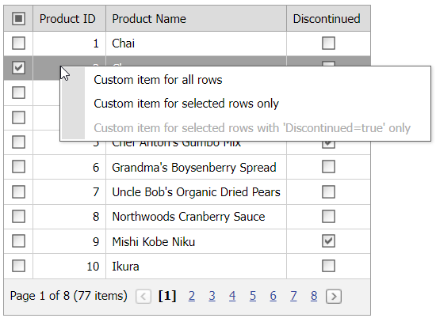

<!-- default badges list -->

[](https://supportcenter.devexpress.com/ticket/details/T120218)
[](https://docs.devexpress.com/GeneralInformation/403183)
<!-- default badges end -->
# Grid View for ASP.NET Web Forms - Enable or disable context menu items and change their visibility based on selected row data

This example demonstrate how to create context menu items and enable/disable or show/hide them on the client or server.



## Overview

In this example, the context menu has three items:

1. The first item is always visible and enabled.
2. The second item is enabled, but visible only for selected rows.
3. The third item is always visible, but enabled only for selected rows that have a checked checkbox in the **Discontinued** column.

To create context menu items, handle the grid's [FillContextMenuItems](https://docs.devexpress.com/AspNet/DevExpress.Web.ASPxGridViewFillContextMenuItemsEventHandler) event. To enable/disable and show/hide menu items, use the client-side or server-side approach.

### Client-Side Approach

Handle the grid's server-side [CustomJSProperties](https://docs.devexpress.com/AspNet/DevExpress.Web.ASPxGridView.CustomJSProperties) event to get row values from the server. Store the values in a `List` object and pass them to the client.

```csharp
protected void Grid_CustomJSProperties(object sender, ASPxGridViewClientJSPropertiesEventArgs e) {
    List<bool> list = new List<bool>();
    for (int i = 0; i < Grid.VisibleRowCount; i++)
        list.Add((bool)Grid.GetRowValues(i, "Discontinued"));
    e.Properties["cpDiscontinued"] = list;
}
```

Handle the grid's client-side [ContextMenu](https://docs.devexpress.com/AspNet/js-ASPxClientGridView.ContextMenu) event. In the handler, do the following:

* Use the [e.menu](https://docs.devexpress.com/AspNet/js-ASPxClientGridViewContextMenuEventArgs.menu) argument property to access the [ClientPopupMenu](https://docs.devexpress.com/AspNet/js-ASPxClientPopupMenu) object.
* Call the [GetItemByName](https://docs.devexpress.com/AspNet/js-ASPxClientMenuBase.GetItemByName(name)) method to get a menu item.
* Call [SetEnabled](https://docs.devexpress.com/AspNet/js-ASPxClientMenuItem.SetEnabled(value)) and [SetVisible](https://docs.devexpress.com/AspNet/js-ASPxClientMenuItem.SetVisible(value)) methods to enable/disable and show/hide menu items based on a condition.

```js
function OnContextMenu(s, e) {
    if(e.objectType == "row") {
        var menuItemSelected = e.menu.GetItemByName("OnlySelectedRows");
        var menuItemSelectedAndDiscontinued = e.menu.GetItemByName("OnlySelectedAndDiscontinuedRows");
        var isRowSelected = s.IsRowSelectedOnPage(e.index);
        var isRowDiscontinued = s.cpDiscontinued[e.index];
        menuItemSelected.SetVisible(isRowSelected);
        menuItemSelectedAndDiscontinued.SetEnabled(isRowSelected && isRowDiscontinued);
    }
}
```

### Server-Side Approach

Handle the grid's [ContextMenuItemVisibility](https://docs.devexpress.com/AspNet/DevExpress.Web.ASPxGridView.ContextMenuItemVisibility) event. In the handler, call [SetVisible](https://docs.devexpress.com/AspNet/devexpress.web.aspxgridviewcontextmenuitemvisibilityeventargs.setvisible.overloads) and [SetEnabled](https://docs.devexpress.com/AspNet/devexpress.web.aspxgridviewcontextmenuitemvisibilityeventargs.setenabled.overloads) methods to show/hide and enable/disable menu items based on a condition.

```csharp
protected void Grid_ContextMenuItemVisibility(object sender, ASPxGridViewContextMenuItemVisibilityEventArgs e) {
    if (e.MenuType == GridViewContextMenuType.Rows) {
        GridViewContextMenuItem menuItemSelected = e.Items.Find(item => item.Name == "OnlySelectedRows") as GridViewContextMenuItem;
        GridViewContextMenuItem menuItemSelectedAndDiscontinued = e.Items.Find(item => item.Name == "OnlySelectedAndDiscontinuedRows") as GridViewContextMenuItem;
        for (int i = 0; i < Grid.VisibleRowCount; i++) {
            e.SetVisible(menuItemSelected, i, Grid.Selection.IsRowSelected(i));
            e.SetEnabled(menuItemSelectedAndDiscontinued, i, Grid.Selection.IsRowSelected(i) && (bool)Grid.GetRowValues(i, "Discontinued"));
        }
    }
}
```

Note that this approach requires sending callbacks to the server. To enable this functionality, set the grid's [ProcessSelectionChangedonServer](https://docs.devexpress.com/AspNet/DevExpress.Web.ASPxGridBehaviorSettings.ProcessSelectionChangedOnServer) property to `true`.

## Files to Review

* [Client-side.aspx](./CS/Client-side.aspx) (VB: [Client-side.aspx](./VB/Client-side.aspx))
* [Client-side.aspx.cs](./CS/Client-side.aspx.cs) (VB: [Client-side.aspx.vb](./VB/Client-side.aspx.vb))
* [Default.aspx](./CS/Default.aspx) (VB: [Default.aspx](./VB/Default.aspx))
* [Default.aspx.cs](./CS/Default.aspx.cs) (VB: [Default.aspx.vb](./VB/Default.aspx.vb))
* [Server-side.aspx](./CS/Server-side.aspx) (VB: [Server-side.aspx](./VB/Server-side.aspx))
* [Server-side.aspx.cs](./CS/Server-side.aspx.cs) (VB: [Server-side.aspx.vb](./VB/Server-side.aspx.vb))

## Documentation

* [Grid Context Menu Items](https://docs.devexpress.com/AspNet/17207/components/grid-view/concepts/data-representation-basics/context-menu/grid-context-menu-items)
* [Grid Selection](https://docs.devexpress.com/AspNet/3737/components/grid-view/concepts/focus-and-navigation/selection)
* [Passing Values Between Client and Server Sides](https://docs.devexpress.com/AspNet/11816/common-concepts/client-side-functionality/passing-values-between-client-and-server-sides)
